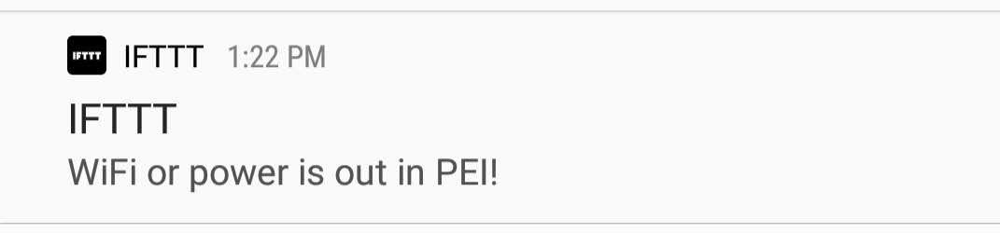
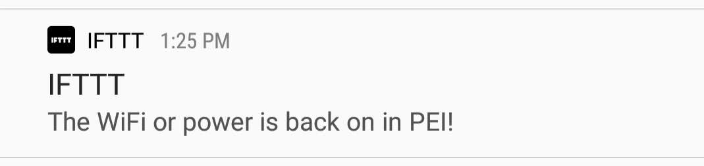
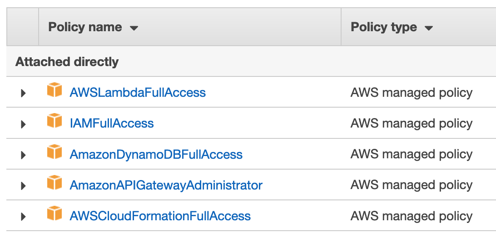

# WiFi Power Outage Notifier

<a href="https://gitlab.com/nfriend/wifi-power-outage-notifier/pipelines" target="_blank"></a>

A [Lambda](https://aws.amazon.com/lambda/) function that sends alerts (through [IFTTT](https://ifttt.com/)) in the case of a WiFi or power outage.


## How it works

This project consists of two Lambda functions:

1. `ping`: Records the current timestamp in a [DynamoDB database](https://aws.amazon.com/dynamodb/).
1. `checkForRecentPings`: Triggered periodically (every five minutes) using a [CloudWatch cron](https://docs.aws.amazon.com/lambda/latest/dg/tutorial-scheduled-events-schedule-expressions.html) and sends a mobile alert if no `ping` has been received in the last five minutes.

A device inside the network (for example, a [Raspberry Pi](https://www.raspberrypi.org/)) makes a request to the `ping` endpoint every two minutes.

An example notification when an outage is detected:



And when the WiFi/power comes back on:



## Setting up the "pinger"

1. `ssh` into the machine inside your network that will be sending the pings.
1. Copy [ping.sh](./src/ping.sh) to `/usr/local/bin/ping.sh`
1. Replace every instance of `<insert ping endpoint URL here>` in the script with the the URL of the ping endpoint.
   1. You can find this endpoint in the `production` job's logs in this project's CI pipeline.
1. Make the new script executable: `chmod u+x ping.sh`
1. Configure the script to run every 2 minutes:
   1. `crontab -e`
   1. Add `*/2 * * * * /usr/local/bin/ping.sh` to the bottom of the file and save

## Developing

1. Clone this repo: `git clone git@gitlab.com:nfriend/wifi-power-outage-notifier.git`
1. Install dependencies: `cd wifi-power-outage-notifier && yarn`
1. Run any of the scripts found in this project's `package.json`, for example: `yarn build:watch`

## Deploying

1. `git push` on `master`

## Project setup

This project expect a few CI/CD variables to be in place:

1. `AWS_ACCESS_KEY_ID`: The access key ID of your AWS IAM user
1. `AWS_SECRET_ACCESS_KEY`: The secret access key of your AWS IAM user
1. `IFTTT_KEY_JSON_ARRAY`: A JSON-formatted array of all [IFTTT Webhook keys](https://help.ifttt.com/hc/en-us/articles/115010230347-Webhooks-service-FAQ) that should be notified if a delay is detected. For example:

   ```json
   ["ifttt-key-1", "ifttt-key-2"]
   ```

1. `AWS_DYNAMO_REGION`: The AWS region of your IAM user (e.g. `ca-central-1`) for usage when setting up a DynamoDB connection

### IAM User

When creating the IAM user for this project, grant the user the following permissions:

- `AWSLambdaFullAccess`
- `IAMFullAccess`
- `AmazonDynamoDBFullAccess`
- `AnazonAPIGatewayAdministrator`
- `AWSCloudFormationFullAccess`


